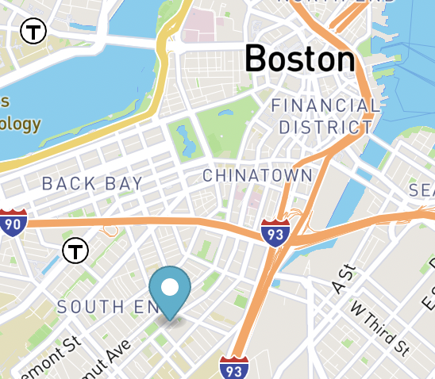

# Bus Tracker Coding Assignment

## Description

The program uses mapbox to create a map with a marker. The program grabs live location data from the MTBA and links it the marker. The program results in an animated icon that moves whenever bus 1870 is on the move.

This repository was created during week 9 of the MIT xPro Professional Certificate in Coding: Full Stack Development with MERN - April 2022

## Installation - Some concepts to help people get started with your project

Register to [mapbox](https://www.mapbox.com/) in order create an [access token](https://docs.mapbox.com/help/getting-started/access-tokens/) and [create map](https://docs.mapbox.com/mapbox-gl-js/api/map/) and [marker](https://docs.mapbox.com/mapbox-gl-js/api/markers/#marker).

The [Route 1 bus locations](https://api-v3.mbta.com/vehicles?filter[route]=1&include=trip) are pulled from a database that is continuously updated.

Use [async functions](https://developer.mozilla.org/en-US/docs/Web/JavaScript/Reference/Statements/async_function) to order your function to run after all the data it gathered.

Use [await operator](https://developer.mozilla.org/en-US/docs/Web/JavaScript/Reference/Operators/await) to wait for a promise.

Use the [fetch() method](https://developer.mozilla.org/en-US/docs/Web/API/fetch) to start the process of fetching the live data.

Create a [button](https://www.w3schools.com/tags/tag_button.asp) to start the tracking.

The json.data array contains objects that are tricky to get a handle on. The getBusLocations function uses [.forEach method](https://developer.mozilla.org/en-US/docs/Web/JavaScript/Reference/Global_Objects/Array/forEach) and [.push method](https://developer.mozilla.org/en-US/docs/Web/JavaScript/Reference/Global_Objects/Array/forEach) and [Object.entires()  method] to filter out and create an array with bus ID, latitude and longitude for each bus.

The function has to run over and over again in order keep updating the location of the bus. The built-in javascript function [timeOut()](https://developer.mozilla.org/en-US/docs/Web/API/setTimeout) is used to set a timer for how often the function will run. ***Don’t set this faster than 15 seconds or else you might get kicked out and blocked from using the data.

## Usage - What can you do with this program?

You can use this program to test out some foundational coding concepts.
Understanding the data set - See if you can change the busID and track a different bus.

Scaling a program - See if you can make the program track all the busses at once.

## Support

Mark Dohle
dohle.mark@gmail.com

## Roadmap

Future versions will include easy to adjust styles for the marker, map and button.

## License information

 </img>

MIT License

Copyright (c) 2022 Mark Dohle

Permission is hereby granted, free of charge, to any person obtaining a copy
of this software and associated documentation files (the "Software"), to deal
in the Software without restriction, including without limitation the rights
to use, copy, modify, merge, publish, distribute, sublicense, and/or sell
copies of the Software, and to permit persons to whom the Software is
furnished to do so, subject to the following conditions:

The above copyright notice and this permission notice shall be included in all copies or substantial portions of the Software.

THE SOFTWARE IS PROVIDED "AS IS", WITHOUT WARRANTY OF ANY KIND, EXPRESS OR
IMPLIED, INCLUDING BUT NOT LIMITED TO THE WARRANTIES OF MERCHANTABILITY,
FITNESS FOR A PARTICULAR PURPOSE AND NONINFRINGEMENT. IN NO EVENT SHALL THE AUTHORS OR COPYRIGHT HOLDERS BE LIABLE FOR ANY CLAIM, DAMAGES OR OTHER LIABILITY, WHETHER IN AN ACTION OF CONTRACT, TORT OR OTHERWISE, ARISING FROM, OUT OF OR IN CONNECTION WITH THE SOFTWARE OR THE USE OR OTHER DEALINGS IN THE SOFTWARE.
